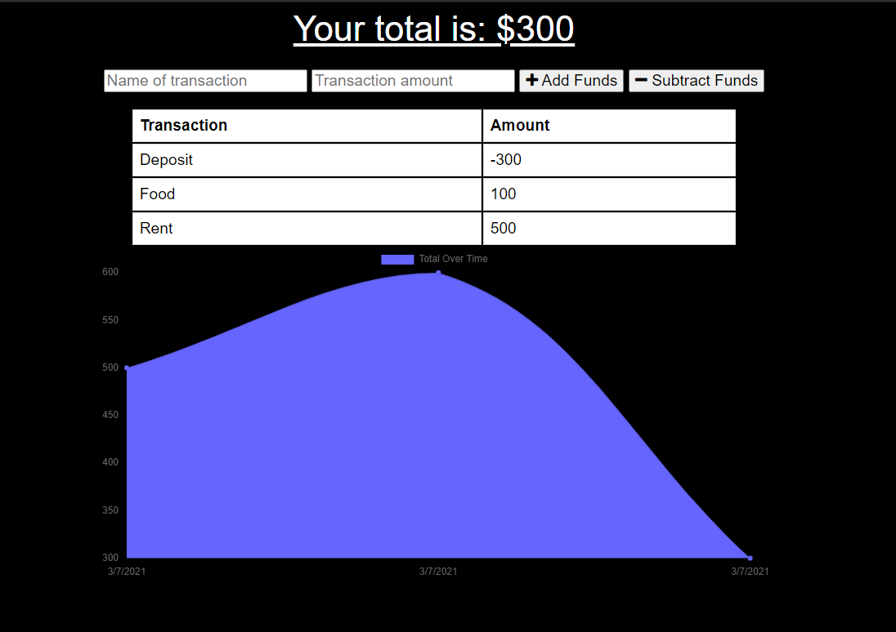

# Budget_Tracker

## Description
A simple budget tracker app that allows you to have offline access and functionality. This app gives the user the ability to view their tracker and add expenses and deposits. 

## Installation
Navigate to the clone directory in the terminal.
```
Run `npm install` to install all dependencies.
```
Once it's that's all done run `node server.js` in your CLI, and then open in your preferred browswer.


## Usage
Find the deployed application [here]()!

The application will look something like this:

